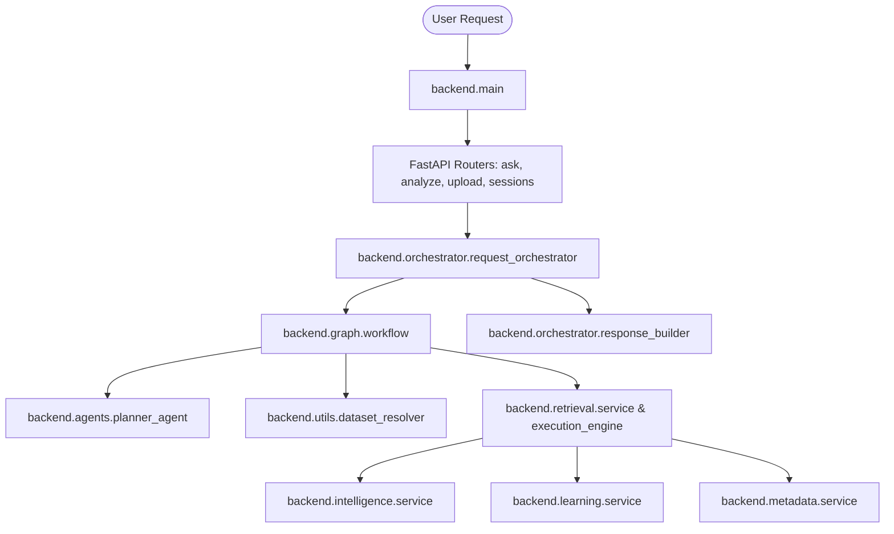

# Runtime Dependency Audit Report (Phase A)

**Generated Date:** 2026-08-02  
**Audit Scope:** Repository-wide AST & Import Graph Reachability Analysis  
**Active Execution Path:**  
`User` -> `FastAPI Routers` -> `RequestOrchestrator` -> `LangGraph Workflow` -> `Planner` -> `Dataset Resolver` -> `Execution Services` -> `Response Builder`  

> [!IMPORTANT]
> **Phase A Constraint Enforcement:** NO files, classes, or lines of code were modified or deleted. This document represents a pure static reachability analysis and classification.

## Executive Summary

| Metric | Total | Reachable | Unreachable / Removable |
| :--- | :---: | :---: | :---: |
| **Backend Modules (`backend/`)** | 269 | 175 | **94** |
| **Backend Lines of Code (LOC)** | 42,528 | 28,646 | **13,882** |
| **Backend Packages** | 43 | 13 Active | **15 Unused**, 15 Partial |
| **Unused Requirements Packages** | 106 | 16 | **90** |
| **Unused Classes in Reachable Code** | 196 | - | **16** |
| **Unused Functions in Reachable Code** | 986 | - | **84** |
| **Unused / Dead Test Files** | 69 | 47 | **22** |

## 1. Package Classification Matrix

Every top-level package inside `backend/` has been evaluated against the production execution path:

| Package | Status | Reachable Modules | Total Modules | Unreachable LOC | Removable Risk Level |
| :--- | :---: | :---: | :---: | :---: | :---: |
| `backend.acquisition` | **PARTIALLY USED** | 10 | 11 | 14 | MEDIUM |
| `backend.adaptive_planning` | **UNUSED** | 0 | 5 | 1,259 | LOW |
| `backend.agents` | **PARTIALLY USED** | 22 | 23 | 0 | MEDIUM |
| `backend.api` | **PARTIALLY USED** | 5 | 6 | 4 | MEDIUM |
| `backend.auth` | **PARTIALLY USED** | 5 | 6 | 18 | MEDIUM |
| `backend.cache` | **PARTIALLY USED** | 4 | 5 | 42 | MEDIUM |
| `backend.config` | **ACTIVE** | 1 | 1 | 0 | NONE |
| `backend.context` | **UNUSED** | 0 | 6 | 1,427 | LOW |
| `backend.core` | **PARTIALLY USED** | 1 | 2 | 2 | MEDIUM |
| `backend.dataset_library` | **ACTIVE** | 9 | 9 | 0 | NONE |
| `backend.dataset_selection` | **UNUSED** | 0 | 4 | 425 | LOW |
| `backend.db` | **ACTIVE** | 1 | 1 | 0 | NONE |
| `backend.errors` | **ACTIVE** | 1 | 1 | 0 | NONE |
| `backend.execution` | **UNUSED** | 0 | 6 | 1,157 | LOW |
| `backend.explainability` | **UNUSED** | 0 | 4 | 1,344 | LOW |
| `backend.feedback` | **UNUSED** | 0 | 5 | 805 | LOW |
| `backend.forecast` | **PARTIALLY USED** | 5 | 6 | 13 | MEDIUM |
| `backend.graph` | **PARTIALLY USED** | 5 | 6 | 3 | MEDIUM |
| `backend.intelligence` | **ACTIVE** | 8 | 8 | 0 | NONE |
| `backend.learning` | **ACTIVE** | 6 | 6 | 0 | NONE |
| `backend.llm` | **PARTIALLY USED** | 1 | 2 | 0 | MEDIUM |
| `backend.main` | **ACTIVE** | 1 | 1 | 0 | NONE |
| `backend.memory` | **PARTIALLY USED** | 7 | 8 | 27 | MEDIUM |
| `backend.metadata` | **ACTIVE** | 5 | 5 | 0 | NONE |
| `backend.orchestrator` | **PARTIALLY USED** | 3 | 4 | 26 | MEDIUM |
| `backend.planning` | **UNUSED** | 0 | 3 | 306 | LOW |
| `backend.production` | **ACTIVE** | 15 | 15 | 0 | NONE |
| `backend.reflection` | **UNUSED** | 0 | 6 | 1,394 | LOW |
| `backend.registry` | **ACTIVE** | 6 | 6 | 0 | NONE |
| `backend.research` | **UNUSED** | 0 | 5 | 1,513 | LOW |
| `backend.retrieval` | **PARTIALLY USED** | 30 | 42 | 634 | MEDIUM |
| `backend.root` | **ACTIVE** | 1 | 1 | 0 | NONE |
| `backend.scripts` | **UNUSED** | 0 | 2 | 113 | LOW |
| `backend.semantic` | **ACTIVE** | 6 | 6 | 0 | NONE |
| `backend.sessions` | **ACTIVE** | 8 | 8 | 0 | NONE |
| `backend.skills` | **UNUSED** | 0 | 10 | 989 | LOW |
| `backend.startup` | **PARTIALLY USED** | 1 | 2 | 0 | MEDIUM |
| `backend.state` | **UNUSED** | 0 | 1 | 57 | LOW |
| `backend.tool_selection` | **UNUSED** | 0 | 5 | 1,444 | LOW |
| `backend.tools` | **UNUSED** | 0 | 4 | 0 | LOW |
| `backend.utils` | **PARTIALLY USED** | 5 | 6 | 60 | MEDIUM |
| `backend.validation` | **UNUSED** | 0 | 2 | 780 | LOW |
| `backend.visualization` | **PARTIALLY USED** | 3 | 4 | 26 | MEDIUM |

## 2. Unreachable Backend Modules (Dead Code)

The following **94 backend modules** are completely unreachable from the active execution path:

| Package | Module Path | Removable LOC | Covered by Tests? | Suggested Action | Risk Level |
| :--- | :--- | :---: | :---: | :--- | :---: |
| `backend.acquisition` | [backend\acquisition\downloaders\__init__.py](file:///C:/Users/abhis/projects/AI-Analyst-Agent/backend/acquisition/downloaders/__init__.py) | 14 | No | Safe for Removal | MEDIUM |
| `backend.adaptive_planning` | [backend\adaptive_planning\__init__.py](file:///C:/Users/abhis/projects/AI-Analyst-Agent/backend/adaptive_planning/__init__.py) | 43 | Yes | Safe for Removal | LOW |
| `backend.adaptive_planning` | [backend\adaptive_planning\models.py](file:///C:/Users/abhis/projects/AI-Analyst-Agent/backend/adaptive_planning/models.py) | 276 | Yes | Safe for Removal | LOW |
| `backend.adaptive_planning` | [backend\adaptive_planning\planner.py](file:///C:/Users/abhis/projects/AI-Analyst-Agent/backend/adaptive_planning/planner.py) | 825 | Yes | Safe for Removal | LOW |
| `backend.adaptive_planning` | [backend\adaptive_planning\prompts.py](file:///C:/Users/abhis/projects/AI-Analyst-Agent/backend/adaptive_planning/prompts.py) | 54 | Yes | Safe for Removal | LOW |
| `backend.adaptive_planning` | [backend\adaptive_planning\state.py](file:///C:/Users/abhis/projects/AI-Analyst-Agent/backend/adaptive_planning/state.py) | 61 | Yes | Safe for Removal | LOW |
| `backend.agents` | [backend\agents\__init__.py](file:///C:/Users/abhis/projects/AI-Analyst-Agent/backend/agents/__init__.py) | 0 | Yes | Safe for Removal | MEDIUM |
| `backend.api` | [backend\api\__init__.py](file:///C:/Users/abhis/projects/AI-Analyst-Agent/backend/api/__init__.py) | 4 | No | Safe for Removal | MEDIUM |
| `backend.auth` | [backend\auth\__init__.py](file:///C:/Users/abhis/projects/AI-Analyst-Agent/backend/auth/__init__.py) | 18 | No | Safe for Removal | MEDIUM |
| `backend.cache` | [backend\cache\__init__.py](file:///C:/Users/abhis/projects/AI-Analyst-Agent/backend/cache/__init__.py) | 42 | No | Safe for Removal | MEDIUM |
| `backend.context` | [backend\context\__init__.py](file:///C:/Users/abhis/projects/AI-Analyst-Agent/backend/context/__init__.py) | 66 | Yes | Safe for Removal | LOW |
| `backend.context` | [backend\context\context_manager.py](file:///C:/Users/abhis/projects/AI-Analyst-Agent/backend/context/context_manager.py) | 569 | Yes | Safe for Removal | LOW |
| `backend.context` | [backend\context\conversation_memory.py](file:///C:/Users/abhis/projects/AI-Analyst-Agent/backend/context/conversation_memory.py) | 155 | Yes | Safe for Removal | LOW |
| `backend.context` | [backend\context\exceptions.py](file:///C:/Users/abhis/projects/AI-Analyst-Agent/backend/context/exceptions.py) | 17 | Yes | Safe for Removal | LOW |
| `backend.context` | [backend\context\models.py](file:///C:/Users/abhis/projects/AI-Analyst-Agent/backend/context/models.py) | 317 | Yes | Safe for Removal | LOW |
| `backend.context` | [backend\context\reference_resolver.py](file:///C:/Users/abhis/projects/AI-Analyst-Agent/backend/context/reference_resolver.py) | 303 | Yes | Safe for Removal | LOW |
| `backend.core` | [backend\core\__init__.py](file:///C:/Users/abhis/projects/AI-Analyst-Agent/backend/core/__init__.py) | 2 | No | Safe for Removal | MEDIUM |
| `backend.dataset_selection` | [backend\dataset_selection\__init__.py](file:///C:/Users/abhis/projects/AI-Analyst-Agent/backend/dataset_selection/__init__.py) | 27 | Yes | Safe for Removal | LOW |
| `backend.dataset_selection` | [backend\dataset_selection\models.py](file:///C:/Users/abhis/projects/AI-Analyst-Agent/backend/dataset_selection/models.py) | 140 | Yes | Safe for Removal | LOW |
| `backend.dataset_selection` | [backend\dataset_selection\prompts.py](file:///C:/Users/abhis/projects/AI-Analyst-Agent/backend/dataset_selection/prompts.py) | 27 | Yes | Safe for Removal | LOW |
| `backend.dataset_selection` | [backend\dataset_selection\selector.py](file:///C:/Users/abhis/projects/AI-Analyst-Agent/backend/dataset_selection/selector.py) | 231 | Yes | Safe for Removal | LOW |
| `backend.execution` | [backend\execution\__init__.py](file:///C:/Users/abhis/projects/AI-Analyst-Agent/backend/execution/__init__.py) | 49 | Yes | Safe for Removal | LOW |
| `backend.execution` | [backend\execution\dataset_merger.py](file:///C:/Users/abhis/projects/AI-Analyst-Agent/backend/execution/dataset_merger.py) | 157 | Yes | Safe for Removal | LOW |
| `backend.execution` | [backend\execution\exceptions.py](file:///C:/Users/abhis/projects/AI-Analyst-Agent/backend/execution/exceptions.py) | 16 | Yes | Safe for Removal | LOW |
| `backend.execution` | [backend\execution\execution_engine.py](file:///C:/Users/abhis/projects/AI-Analyst-Agent/backend/execution/execution_engine.py) | 462 | Yes | Safe for Removal | LOW |
| `backend.execution` | [backend\execution\models.py](file:///C:/Users/abhis/projects/AI-Analyst-Agent/backend/execution/models.py) | 145 | Yes | Safe for Removal | LOW |
| `backend.execution` | [backend\execution\schema_alignment.py](file:///C:/Users/abhis/projects/AI-Analyst-Agent/backend/execution/schema_alignment.py) | 328 | Yes | Safe for Removal | LOW |
| `backend.explainability` | [backend\explainability\__init__.py](file:///C:/Users/abhis/projects/AI-Analyst-Agent/backend/explainability/__init__.py) | 49 | Yes | Safe for Removal | LOW |
| `backend.explainability` | [backend\explainability\explainer.py](file:///C:/Users/abhis/projects/AI-Analyst-Agent/backend/explainability/explainer.py) | 644 | Yes | Safe for Removal | LOW |
| `backend.explainability` | [backend\explainability\models.py](file:///C:/Users/abhis/projects/AI-Analyst-Agent/backend/explainability/models.py) | 317 | Yes | Safe for Removal | LOW |
| `backend.explainability` | [backend\explainability\templates.py](file:///C:/Users/abhis/projects/AI-Analyst-Agent/backend/explainability/templates.py) | 334 | Yes | Safe for Removal | LOW |
| `backend.feedback` | [backend\feedback\__init__.py](file:///C:/Users/abhis/projects/AI-Analyst-Agent/backend/feedback/__init__.py) | 38 | Yes | Safe for Removal | LOW |
| `backend.feedback` | [backend\feedback\feedback_service.py](file:///C:/Users/abhis/projects/AI-Analyst-Agent/backend/feedback/feedback_service.py) | 279 | Yes | Safe for Removal | LOW |
| `backend.feedback` | [backend\feedback\memory.py](file:///C:/Users/abhis/projects/AI-Analyst-Agent/backend/feedback/memory.py) | 103 | Yes | Safe for Removal | LOW |
| `backend.feedback` | [backend\feedback\models.py](file:///C:/Users/abhis/projects/AI-Analyst-Agent/backend/feedback/models.py) | 191 | Yes | Safe for Removal | LOW |
| `backend.feedback` | [backend\feedback\scorer.py](file:///C:/Users/abhis/projects/AI-Analyst-Agent/backend/feedback/scorer.py) | 194 | Yes | Safe for Removal | LOW |
| `backend.forecast` | [backend\forecast\__init__.py](file:///C:/Users/abhis/projects/AI-Analyst-Agent/backend/forecast/__init__.py) | 13 | No | Safe for Removal | MEDIUM |
| `backend.graph` | [backend\graph\__init__.py](file:///C:/Users/abhis/projects/AI-Analyst-Agent/backend/graph/__init__.py) | 3 | No | Safe for Removal | MEDIUM |
| `backend.llm` | [backend\llm\__init__.py](file:///C:/Users/abhis/projects/AI-Analyst-Agent/backend/llm/__init__.py) | 0 | Yes | Safe for Removal | MEDIUM |
| `backend.memory` | [backend\memory\__init__.py](file:///C:/Users/abhis/projects/AI-Analyst-Agent/backend/memory/__init__.py) | 27 | No | Safe for Removal | MEDIUM |
| `backend.orchestrator` | [backend\orchestrator\__init__.py](file:///C:/Users/abhis/projects/AI-Analyst-Agent/backend/orchestrator/__init__.py) | 26 | No | Safe for Removal | MEDIUM |
| `backend.planning` | [backend\planning\__init__.py](file:///C:/Users/abhis/projects/AI-Analyst-Agent/backend/planning/__init__.py) | 14 | Yes | Safe for Removal | LOW |
| `backend.planning` | [backend\planning\models.py](file:///C:/Users/abhis/projects/AI-Analyst-Agent/backend/planning/models.py) | 42 | Yes | Safe for Removal | LOW |
| `backend.planning` | [backend\planning\multi_dataset_planner.py](file:///C:/Users/abhis/projects/AI-Analyst-Agent/backend/planning/multi_dataset_planner.py) | 250 | Yes | Safe for Removal | LOW |
| `backend.reflection` | [backend\reflection\__init__.py](file:///C:/Users/abhis/projects/AI-Analyst-Agent/backend/reflection/__init__.py) | 48 | Yes | Safe for Removal | LOW |
| `backend.reflection` | [backend\reflection\exceptions.py](file:///C:/Users/abhis/projects/AI-Analyst-Agent/backend/reflection/exceptions.py) | 8 | Yes | Safe for Removal | LOW |
| `backend.reflection` | [backend\reflection\models.py](file:///C:/Users/abhis/projects/AI-Analyst-Agent/backend/reflection/models.py) | 258 | Yes | Safe for Removal | LOW |
| `backend.reflection` | [backend\reflection\prompts.py](file:///C:/Users/abhis/projects/AI-Analyst-Agent/backend/reflection/prompts.py) | 52 | Yes | Safe for Removal | LOW |
| `backend.reflection` | [backend\reflection\reflection_agent.py](file:///C:/Users/abhis/projects/AI-Analyst-Agent/backend/reflection/reflection_agent.py) | 427 | Yes | Safe for Removal | LOW |
| `backend.reflection` | [backend\reflection\validator.py](file:///C:/Users/abhis/projects/AI-Analyst-Agent/backend/reflection/validator.py) | 601 | Yes | Safe for Removal | LOW |
| `backend.research` | [backend\research\__init__.py](file:///C:/Users/abhis/projects/AI-Analyst-Agent/backend/research/__init__.py) | 43 | Yes | Safe for Removal | LOW |
| `backend.research` | [backend\research\models.py](file:///C:/Users/abhis/projects/AI-Analyst-Agent/backend/research/models.py) | 291 | Yes | Safe for Removal | LOW |
| `backend.research` | [backend\research\planner.py](file:///C:/Users/abhis/projects/AI-Analyst-Agent/backend/research/planner.py) | 860 | Yes | Safe for Removal | LOW |
| `backend.research` | [backend\research\prompts.py](file:///C:/Users/abhis/projects/AI-Analyst-Agent/backend/research/prompts.py) | 104 | Yes | Safe for Removal | LOW |
| `backend.research` | [backend\research\research_agent.py](file:///C:/Users/abhis/projects/AI-Analyst-Agent/backend/research/research_agent.py) | 215 | Yes | Safe for Removal | LOW |
| `backend.retrieval` | [backend\retrieval\data_providers\__init__.py](file:///C:/Users/abhis/projects/AI-Analyst-Agent/backend/retrieval/data_providers/__init__.py) | 63 | Yes | Safe for Removal | MEDIUM |
| `backend.retrieval` | [backend\retrieval\providers\__init__.py](file:///C:/Users/abhis/projects/AI-Analyst-Agent/backend/retrieval/providers/__init__.py) | 17 | No | Safe for Removal | MEDIUM |
| `backend.retrieval` | [backend\retrieval\providers\internet_search_provider.py](file:///C:/Users/abhis/projects/AI-Analyst-Agent/backend/retrieval/providers/internet_search_provider.py) | 69 | Yes | Safe for Removal | MEDIUM |
| `backend.retrieval` | [backend\retrieval\providers\official_api_provider.py](file:///C:/Users/abhis/projects/AI-Analyst-Agent/backend/retrieval/providers/official_api_provider.py) | 61 | Yes | Safe for Removal | MEDIUM |
| `backend.retrieval` | [backend\retrieval\sources\__init__.py](file:///C:/Users/abhis/projects/AI-Analyst-Agent/backend/retrieval/sources/__init__.py) | 32 | Yes | Safe for Removal | MEDIUM |
| `backend.retrieval` | [backend\retrieval\sources\base.py](file:///C:/Users/abhis/projects/AI-Analyst-Agent/backend/retrieval/sources/base.py) | 31 | Yes | Safe for Removal | MEDIUM |
| `backend.retrieval` | [backend\retrieval\sources\github.py](file:///C:/Users/abhis/projects/AI-Analyst-Agent/backend/retrieval/sources/github.py) | 45 | Yes | Safe for Removal | MEDIUM |
| `backend.retrieval` | [backend\retrieval\sources\huggingface.py](file:///C:/Users/abhis/projects/AI-Analyst-Agent/backend/retrieval/sources/huggingface.py) | 45 | Yes | Safe for Removal | MEDIUM |
| `backend.retrieval` | [backend\retrieval\sources\imf.py](file:///C:/Users/abhis/projects/AI-Analyst-Agent/backend/retrieval/sources/imf.py) | 62 | Yes | Safe for Removal | MEDIUM |
| `backend.retrieval` | [backend\retrieval\sources\oecd.py](file:///C:/Users/abhis/projects/AI-Analyst-Agent/backend/retrieval/sources/oecd.py) | 48 | Yes | Safe for Removal | MEDIUM |
| `backend.retrieval` | [backend\retrieval\sources\wikipedia.py](file:///C:/Users/abhis/projects/AI-Analyst-Agent/backend/retrieval/sources/wikipedia.py) | 60 | Yes | Safe for Removal | MEDIUM |
| `backend.retrieval` | [backend\retrieval\sources\world_bank.py](file:///C:/Users/abhis/projects/AI-Analyst-Agent/backend/retrieval/sources/world_bank.py) | 101 | Yes | Safe for Removal | MEDIUM |
| `backend.scripts` | [backend\scripts\check_ollama.py](file:///C:/Users/abhis/projects/AI-Analyst-Agent/backend/scripts/check_ollama.py) | 24 | No | Safe for Removal | LOW |
| `backend.scripts` | [backend\scripts\validate_dataset_sources.py](file:///C:/Users/abhis/projects/AI-Analyst-Agent/backend/scripts/validate_dataset_sources.py) | 89 | No | Safe for Removal | LOW |
| `backend.skills` | [backend\skills\__init__.py](file:///C:/Users/abhis/projects/AI-Analyst-Agent/backend/skills/__init__.py) | 42 | Yes | Safe for Removal | LOW |
| `backend.skills` | [backend\skills\base.py](file:///C:/Users/abhis/projects/AI-Analyst-Agent/backend/skills/base.py) | 134 | Yes | Safe for Removal | LOW |
| `backend.skills` | [backend\skills\discovery.py](file:///C:/Users/abhis/projects/AI-Analyst-Agent/backend/skills/discovery.py) | 233 | Yes | Safe for Removal | LOW |
| `backend.skills` | [backend\skills\loader.py](file:///C:/Users/abhis/projects/AI-Analyst-Agent/backend/skills/loader.py) | 193 | Yes | Safe for Removal | LOW |
| `backend.skills` | [backend\skills\metadata.py](file:///C:/Users/abhis/projects/AI-Analyst-Agent/backend/skills/metadata.py) | 72 | Yes | Safe for Removal | LOW |
| `backend.skills` | [backend\skills\plugins\__init__.py](file:///C:/Users/abhis/projects/AI-Analyst-Agent/backend/skills/plugins/__init__.py) | 1 | Yes | Safe for Removal | LOW |
| `backend.skills` | [backend\skills\plugins\correlation_skill.py](file:///C:/Users/abhis/projects/AI-Analyst-Agent/backend/skills/plugins/correlation_skill.py) | 27 | No | Safe for Removal | LOW |
| `backend.skills` | [backend\skills\plugins\forecast_skill.py](file:///C:/Users/abhis/projects/AI-Analyst-Agent/backend/skills/plugins/forecast_skill.py) | 30 | Yes | Safe for Removal | LOW |
| `backend.skills` | [backend\skills\plugins\visualization_skill.py](file:///C:/Users/abhis/projects/AI-Analyst-Agent/backend/skills/plugins/visualization_skill.py) | 28 | No | Safe for Removal | LOW |
| `backend.skills` | [backend\skills\registry.py](file:///C:/Users/abhis/projects/AI-Analyst-Agent/backend/skills/registry.py) | 229 | Yes | Safe for Removal | LOW |
| `backend.startup` | [backend\startup\__init__.py](file:///C:/Users/abhis/projects/AI-Analyst-Agent/backend/startup/__init__.py) | 0 | No | Safe for Removal | MEDIUM |
| `backend.state` | [backend\state.py](file:///C:/Users/abhis/projects/AI-Analyst-Agent/backend/state.py) | 57 | No | Safe for Removal | LOW |
| `backend.tool_selection` | [backend\tool_selection\__init__.py](file:///C:/Users/abhis/projects/AI-Analyst-Agent/backend/tool_selection/__init__.py) | 58 | Yes | Safe for Removal | LOW |
| `backend.tool_selection` | [backend\tool_selection\models.py](file:///C:/Users/abhis/projects/AI-Analyst-Agent/backend/tool_selection/models.py) | 271 | Yes | Safe for Removal | LOW |
| `backend.tool_selection` | [backend\tool_selection\prompts.py](file:///C:/Users/abhis/projects/AI-Analyst-Agent/backend/tool_selection/prompts.py) | 110 | Yes | Safe for Removal | LOW |
| `backend.tool_selection` | [backend\tool_selection\registry.py](file:///C:/Users/abhis/projects/AI-Analyst-Agent/backend/tool_selection/registry.py) | 457 | Yes | Safe for Removal | LOW |
| `backend.tool_selection` | [backend\tool_selection\selector.py](file:///C:/Users/abhis/projects/AI-Analyst-Agent/backend/tool_selection/selector.py) | 548 | Yes | Safe for Removal | LOW |
| `backend.tools` | [backend\tools\__init__.py](file:///C:/Users/abhis/projects/AI-Analyst-Agent/backend/tools/__init__.py) | 0 | No | Safe for Removal | LOW |
| `backend.tools` | [backend\tools\data_loader.py](file:///C:/Users/abhis/projects/AI-Analyst-Agent/backend/tools/data_loader.py) | 0 | No | Safe for Removal | LOW |
| `backend.tools` | [backend\tools\llm.py](file:///C:/Users/abhis/projects/AI-Analyst-Agent/backend/tools/llm.py) | 0 | No | Safe for Removal | LOW |
| `backend.tools` | [backend\tools\plotter.py](file:///C:/Users/abhis/projects/AI-Analyst-Agent/backend/tools/plotter.py) | 0 | No | Safe for Removal | LOW |
| `backend.utils` | [backend\utils\column_semantic_mapper.py](file:///C:/Users/abhis/projects/AI-Analyst-Agent/backend/utils/column_semantic_mapper.py) | 60 | No | Safe for Removal | MEDIUM |
| `backend.validation` | [backend\validation\__init__.py](file:///C:/Users/abhis/projects/AI-Analyst-Agent/backend/validation/__init__.py) | 23 | Yes | Safe for Removal | LOW |
| `backend.validation` | [backend\validation\dataset_sources.py](file:///C:/Users/abhis/projects/AI-Analyst-Agent/backend/validation/dataset_sources.py) | 757 | Yes | Safe for Removal | LOW |
| `backend.visualization` | [backend\visualization\__init__.py](file:///C:/Users/abhis/projects/AI-Analyst-Agent/backend/visualization/__init__.py) | 26 | No | Safe for Removal | MEDIUM |

## 3. Unused Artifacts Breakdown

### 3.1 Unused Requirements Packages (`requirements.txt`)

The following packages are listed in `requirements.txt` but are never imported anywhere in the codebase:

- `backend.requirements`: **`GitPython`** (No import statement found across repo)
- `backend.requirements`: **`Jinja2`** (No import statement found across repo)
- `backend.requirements`: **`MarkupSafe`** (No import statement found across repo)
- `backend.requirements`: **`PyYAML`** (No import statement found across repo)
- `backend.requirements`: **`aiohappyeyeballs`** (No import statement found across repo)
- `backend.requirements`: **`aiohttp`** (No import statement found across repo)
- `backend.requirements`: **`aiosignal`** (No import statement found across repo)
- `backend.requirements`: **`altair`** (No import statement found across repo)
- `backend.requirements`: **`annotated-doc`** (No import statement found across repo)
- `backend.requirements`: **`annotated-types`** (No import statement found across repo)
- `backend.requirements`: **`anyio`** (No import statement found across repo)
- `backend.requirements`: **`attrs`** (No import statement found across repo)
- `backend.requirements`: **`blinker`** (No import statement found across repo)
- `backend.requirements`: **`cachetools`** (No import statement found across repo)
- `backend.requirements`: **`certifi`** (No import statement found across repo)
- `backend.requirements`: **`charset-normalizer`** (No import statement found across repo)
- `backend.requirements`: **`click`** (No import statement found across repo)
- `backend.requirements`: **`colorama`** (No import statement found across repo)
- `backend.requirements`: **`contourpy`** (No import statement found across repo)
- `backend.requirements`: **`cycler`** (No import statement found across repo)
- `backend.requirements`: **`dataclasses-json`** (No import statement found across repo)
- `backend.requirements`: **`distro`** (No import statement found across repo)
- `backend.requirements`: **`fonttools`** (No import statement found across repo)
- `backend.requirements`: **`frozenlist`** (No import statement found across repo)
- `backend.requirements`: **`gitdb`** (No import statement found across repo)
- `backend.requirements`: **`greenlet`** (No import statement found across repo)
- `backend.requirements`: **`h11`** (No import statement found across repo)
- `backend.requirements`: **`httpcore`** (No import statement found across repo)
- `backend.requirements`: **`httpx`** (No import statement found across repo)
- `backend.requirements`: **`httpx-sse`** (No import statement found across repo)
- `backend.requirements`: **`idna`** (No import statement found across repo)
- `backend.requirements`: **`jiter`** (No import statement found across repo)
- `backend.requirements`: **`jsonpatch`** (No import statement found across repo)
- `backend.requirements`: **`jsonpointer`** (No import statement found across repo)
- `backend.requirements`: **`jsonschema`** (No import statement found across repo)
- `backend.requirements`: **`jsonschema-specifications`** (No import statement found across repo)
- `backend.requirements`: **`kiwisolver`** (No import statement found across repo)
- `backend.requirements`: **`langchain`** (No import statement found across repo)
- `backend.requirements`: **`langchain-classic`** (No import statement found across repo)
- `backend.requirements`: **`langchain-experimental`** (No import statement found across repo)
- `backend.requirements`: **`langchain-openai`** (No import statement found across repo)
- `backend.requirements`: **`langchain-text-splitters`** (No import statement found across repo)
- `backend.requirements`: **`langgraph-checkpoint`** (No import statement found across repo)
- `backend.requirements`: **`langgraph-prebuilt`** (No import statement found across repo)
- `backend.requirements`: **`langgraph-sdk`** (No import statement found across repo)
- `backend.requirements`: **`langsmith`** (No import statement found across repo)
- `backend.requirements`: **`marshmallow`** (No import statement found across repo)
- `backend.requirements`: **`matplotlib`** (No import statement found across repo)
- `backend.requirements`: **`multidict`** (No import statement found across repo)
- `backend.requirements`: **`mypy_extensions`** (No import statement found across repo)
- `backend.requirements`: **`narwhals`** (No import statement found across repo)
- `backend.requirements`: **`openai`** (No import statement found across repo)
- `backend.requirements`: **`openpyxl`** (No import statement found across repo)
- `backend.requirements`: **`orjson`** (No import statement found across repo)
- `backend.requirements`: **`ormsgpack`** (No import statement found across repo)
- `backend.requirements`: **`packaging`** (No import statement found across repo)
- `backend.requirements`: **`pillow`** (No import statement found across repo)
- `backend.requirements`: **`propcache`** (No import statement found across repo)
- `backend.requirements`: **`protobuf`** (No import statement found across repo)
- `backend.requirements`: **`pyarrow`** (No import statement found across repo)
- `backend.requirements`: **`pydantic_core`** (No import statement found across repo)
- `backend.requirements`: **`pydeck`** (No import statement found across repo)
- `backend.requirements`: **`pyparsing`** (No import statement found across repo)
- `backend.requirements`: **`python-dateutil`** (No import statement found across repo)
- `backend.requirements`: **`python-multipart`** (No import statement found across repo)
- `backend.requirements`: **`referencing`** (No import statement found across repo)
- `backend.requirements`: **`regex`** (No import statement found across repo)
- `backend.requirements`: **`requests-toolbelt`** (No import statement found across repo)
- `backend.requirements`: **`rpds-py`** (No import statement found across repo)
- `backend.requirements`: **`six`** (No import statement found across repo)
- `backend.requirements`: **`smmap`** (No import statement found across repo)
- `backend.requirements`: **`sniffio`** (No import statement found across repo)
- `backend.requirements`: **`streamlit`** (No import statement found across repo)
- `backend.requirements`: **`tabulate`** (No import statement found across repo)
- `backend.requirements`: **`tenacity`** (No import statement found across repo)
- `backend.requirements`: **`tiktoken`** (No import statement found across repo)
- `backend.requirements`: **`toml`** (No import statement found across repo)
- `backend.requirements`: **`tornado`** (No import statement found across repo)
- `backend.requirements`: **`tqdm`** (No import statement found across repo)
- `backend.requirements`: **`typing-inspect`** (No import statement found across repo)
- `backend.requirements`: **`typing-inspection`** (No import statement found across repo)
- `backend.requirements`: **`typing_extensions`** (No import statement found across repo)
- `backend.requirements`: **`tzdata`** (No import statement found across repo)
- `backend.requirements`: **`urllib3`** (No import statement found across repo)
- `backend.requirements`: **`uuid_utils`** (No import statement found across repo)
- `backend.requirements`: **`uvicorn`** (No import statement found across repo)
- `backend.requirements`: **`watchdog`** (No import statement found across repo)
- `backend.requirements`: **`xxhash`** (No import statement found across repo)
- `backend.requirements`: **`yarl`** (No import statement found across repo)
- `backend.requirements`: **`zstandard`** (No import statement found across repo)

### 3.2 Unused Classes in Reachable Modules

Classes defined inside active modules that have 0 references across the execution path:

| Class Name | Module File | Location | Removable LOC | Risk Level |
| :--- | :--- | :--- | :---: | :---: |
| `Retryable` | [backend\production\retry.py](file:///C:/Users/abhis/projects/AI-Analyst-Agent/backend\production\retry.py) | Line 90 | 12 | LOW |
| `ProviderSearchResult` | [backend\retrieval\data_providers\base.py](file:///C:/Users/abhis/projects/AI-Analyst-Agent/backend\retrieval\data_providers\base.py) | Line 66 | 15 | LOW |
| `CorruptionError` | [backend\acquisition\exceptions.py](file:///C:/Users/abhis/projects/AI-Analyst-Agent/backend\acquisition\exceptions.py) | Line 16 | 2 | LOW |
| `LearningRegistryError` | [backend\learning\exceptions.py](file:///C:/Users/abhis/projects/AI-Analyst-Agent/backend\learning\exceptions.py) | Line 12 | 2 | LOW |
| `AskCacheKeyParts` | [backend\cache\ask_cache.py](file:///C:/Users/abhis/projects/AI-Analyst-Agent/backend\cache\ask_cache.py) | Line 61 | 12 | LOW |
| `SessionListResponse` | [backend\sessions\schemas.py](file:///C:/Users/abhis/projects/AI-Analyst-Agent/backend\sessions\schemas.py) | Line 141 | 8 | LOW |
| `SessionDetailResponse` | [backend\sessions\schemas.py](file:///C:/Users/abhis/projects/AI-Analyst-Agent/backend\sessions\schemas.py) | Line 151 | 42 | LOW |
| `SessionExportBundle` | [backend\sessions\schemas.py](file:///C:/Users/abhis/projects/AI-Analyst-Agent/backend\sessions\schemas.py) | Line 195 | 6 | LOW |
| `SessionActionResponse` | [backend\sessions\schemas.py](file:///C:/Users/abhis/projects/AI-Analyst-Agent/backend\sessions\schemas.py) | Line 203 | 10 | LOW |
| `SessionDeleteResponse` | [backend\sessions\schemas.py](file:///C:/Users/abhis/projects/AI-Analyst-Agent/backend\sessions\schemas.py) | Line 215 | 4 | LOW |
| `SessionDuplicateResponse` | [backend\sessions\schemas.py](file:///C:/Users/abhis/projects/AI-Analyst-Agent/backend\sessions\schemas.py) | Line 221 | 2 | LOW |
| `SessionImportResponse` | [backend\sessions\schemas.py](file:///C:/Users/abhis/projects/AI-Analyst-Agent/backend\sessions\schemas.py) | Line 225 | 3 | LOW |
| `ErrorResponse` | [backend\sessions\schemas.py](file:///C:/Users/abhis/projects/AI-Analyst-Agent/backend\sessions\schemas.py) | Line 230 | 4 | LOW |
| `SessionSearchResponse` | [backend\sessions\schemas.py](file:///C:/Users/abhis/projects/AI-Analyst-Agent/backend\sessions\schemas.py) | Line 270 | 8 | LOW |
| `SessionCheckpointListResponse` | [backend\sessions\schemas.py](file:///C:/Users/abhis/projects/AI-Analyst-Agent/backend\sessions\schemas.py) | Line 306 | 4 | LOW |
| `SessionResumeResponse` | [backend\sessions\schemas.py](file:///C:/Users/abhis/projects/AI-Analyst-Agent/backend\sessions\schemas.py) | Line 312 | 8 | LOW |

### 3.3 Unused Functions in Reachable Modules

Functions defined inside active modules that are never called or referenced:

| Function Name | Module File | Location | Removable LOC | Risk Level |
| :--- | :--- | :--- | :---: | :---: |
| `_handle_access` | [backend\sessions\router.py](file:///C:/Users/abhis/projects/AI-Analyst-Agent/backend\sessions\router.py) | Line 70 | 6 | LOW |
| `auth_me` | [backend\sessions\router.py](file:///C:/Users/abhis/projects/AI-Analyst-Agent/backend\sessions\router.py) | Line 293 | 3 | LOW |
| `get_session` | [backend\sessions\router.py](file:///C:/Users/abhis/projects/AI-Analyst-Agent/backend\sessions\router.py) | Line 305 | 18 | LOW |
| `favorite_session` | [backend\sessions\router.py](file:///C:/Users/abhis/projects/AI-Analyst-Agent/backend\sessions\router.py) | Line 463 | 22 | LOW |
| `pin_session` | [backend\sessions\router.py](file:///C:/Users/abhis/projects/AI-Analyst-Agent/backend\sessions\router.py) | Line 489 | 25 | LOW |
| `set_semantic_service` | [backend\semantic\service.py](file:///C:/Users/abhis/projects/AI-Analyst-Agent/backend\semantic\service.py) | Line 210 | 3 | LOW |
| `upload_dataset` | [backend\api\upload.py](file:///C:/Users/abhis/projects/AI-Analyst-Agent/backend\api\upload.py) | Line 18 | 27 | LOW |
| `clear_metric_samples` | [backend\production\metrics_store.py](file:///C:/Users/abhis/projects/AI-Analyst-Agent/backend\production\metrics_store.py) | Line 204 | 10 | LOW |
| `request_logging_middleware` | [backend\main.py](file:///C:/Users/abhis/projects/AI-Analyst-Agent/backend\main.py) | Line 69 | 21 | LOW |
| `validate_ollama` | [backend\main.py](file:///C:/Users/abhis/projects/AI-Analyst-Agent/backend\main.py) | Line 93 | 34 | LOW |
| `put_writes` | [backend\graph\checkpointer.py](file:///C:/Users/abhis/projects/AI-Analyst-Agent/backend\graph\checkpointer.py) | Line 211 | 22 | LOW |
| `delete_thread` | [backend\graph\checkpointer.py](file:///C:/Users/abhis/projects/AI-Analyst-Agent/backend\graph\checkpointer.py) | Line 234 | 3 | LOW |
| `delete_for_runs` | [backend\graph\checkpointer.py](file:///C:/Users/abhis/projects/AI-Analyst-Agent/backend\graph\checkpointer.py) | Line 238 | 3 | LOW |
| `copy_thread` | [backend\graph\checkpointer.py](file:///C:/Users/abhis/projects/AI-Analyst-Agent/backend\graph\checkpointer.py) | Line 242 | 19 | LOW |
| `time_block` | [backend\production\metrics.py](file:///C:/Users/abhis/projects/AI-Analyst-Agent/backend\production\metrics.py) | Line 63 | 29 | LOW |
| `mark_failed` | [backend\production\metrics.py](file:///C:/Users/abhis/projects/AI-Analyst-Agent/backend\production\metrics.py) | Line 74 | 2 | LOW |
| `add_retries` | [backend\production\metrics.py](file:///C:/Users/abhis/projects/AI-Analyst-Agent/backend\production\metrics.py) | Line 77 | 2 | LOW |
| `set_gauge` | [backend\production\metrics.py](file:///C:/Users/abhis/projects/AI-Analyst-Agent/backend\production\metrics.py) | Line 108 | 3 | LOW |
| `reset_metrics_collector` | [backend\production\metrics.py](file:///C:/Users/abhis/projects/AI-Analyst-Agent/backend\production\metrics.py) | Line 196 | 6 | LOW |
| `add_seconds` | [backend\production\pipeline_timing.py](file:///C:/Users/abhis/projects/AI-Analyst-Agent/backend\production\pipeline_timing.py) | Line 114 | 2 | LOW |
| `set_label` | [backend\production\pipeline_timing.py](file:///C:/Users/abhis/projects/AI-Analyst-Agent/backend\production\pipeline_timing.py) | Line 117 | 6 | LOW |
| `merge_into_state` | [backend\production\pipeline_timing.py](file:///C:/Users/abhis/projects/AI-Analyst-Agent/backend\production\pipeline_timing.py) | Line 155 | 11 | LOW |
| `time_callable` | [backend\production\pipeline_timing.py](file:///C:/Users/abhis/projects/AI-Analyst-Agent/backend\production\pipeline_timing.py) | Line 233 | 3 | LOW |
| `reset_aggregate_timing_stats` | [backend\production\pipeline_timing.py](file:///C:/Users/abhis/projects/AI-Analyst-Agent/backend\production\pipeline_timing.py) | Line 434 | 3 | LOW |
| `analyze` | [backend\api\analyze.py](file:///C:/Users/abhis/projects/AI-Analyst-Agent/backend\api\analyze.py) | Line 15 | 8 | LOW |
| `health` | [backend\production\health.py](file:///C:/Users/abhis/projects/AI-Analyst-Agent/backend\production\health.py) | Line 178 | 36 | LOW |
| `health_endpoint` | [backend\production\observability_router.py](file:///C:/Users/abhis/projects/AI-Analyst-Agent/backend\production\observability_router.py) | Line 25 | 19 | LOW |
| `metrics_endpoint` | [backend\production\observability_router.py](file:///C:/Users/abhis/projects/AI-Analyst-Agent/backend\production\observability_router.py) | Line 48 | 35 | LOW |
| `performance_endpoint` | [backend\production\observability_router.py](file:///C:/Users/abhis/projects/AI-Analyst-Agent/backend\production\observability_router.py) | Line 87 | 9 | LOW |
| `metrics_prometheus` | [backend\production\observability_router.py](file:///C:/Users/abhis/projects/AI-Analyst-Agent/backend\production\observability_router.py) | Line 100 | 4 | LOW |

### 3.4 Dead Test Suite Files (`tests/`)

Test files that test unreachable modules or import zero backend modules:

| Test File Path | Removable LOC | Reason | Risk Level |
| :--- | :---: | :--- | :---: |
| [tests\test_adaptive_planner.py](file:///C:/Users/abhis/projects/AI-Analyst-Agent/tests\test_adaptive_planner.py) | 309 | Tests unreachable modules (backend.adaptive_planning, backend.adaptive_planning) | LOW |
| [tests\test_conversation_context.py](file:///C:/Users/abhis/projects/AI-Analyst-Agent/tests\test_conversation_context.py) | 302 | Tests unreachable modules (backend.context, backend.context) | LOW |
| [tests\test_dataset_selection.py](file:///C:/Users/abhis/projects/AI-Analyst-Agent/tests\test_dataset_selection.py) | 81 | Tests unreachable modules (backend.dataset_selection, backend.dataset_selection) | LOW |
| [tests\test_dataset_source_validation.py](file:///C:/Users/abhis/projects/AI-Analyst-Agent/tests\test_dataset_source_validation.py) | 176 | Tests unreachable modules (backend.validation.dataset_sources, backend.validation.dataset_sources) | LOW |
| [tests\test_explainability.py](file:///C:/Users/abhis/projects/AI-Analyst-Agent/tests\test_explainability.py) | 277 | Tests unreachable modules (backend.explainability, backend.explainability) | LOW |
| [tests\test_feedback.py](file:///C:/Users/abhis/projects/AI-Analyst-Agent/tests\test_feedback.py) | 182 | Tests unreachable modules (backend.feedback, backend.feedback) | LOW |
| [tests\test_reflection_agent.py](file:///C:/Users/abhis/projects/AI-Analyst-Agent/tests\test_reflection_agent.py) | 330 | Tests unreachable modules (backend.reflection, backend.reflection) | LOW |
| [tests\test_research_agent.py](file:///C:/Users/abhis/projects/AI-Analyst-Agent/tests\test_research_agent.py) | 171 | Tests unreachable modules (backend.research, backend.research) | LOW |
| [tests\test_skill_discovery.py](file:///C:/Users/abhis/projects/AI-Analyst-Agent/tests\test_skill_discovery.py) | 218 | Tests unreachable modules (backend.skills.loader, backend.skills) | LOW |
| [tests\test_tool_selection.py](file:///C:/Users/abhis/projects/AI-Analyst-Agent/tests\test_tool_selection.py) | 256 | Tests unreachable modules (backend.tool_selection, backend.tool_selection) | LOW |
| [tests\e2e_workflow\probe_extra.py](file:///C:/Users/abhis/projects/AI-Analyst-Agent/tests\e2e_workflow\probe_extra.py) | 66 | No backend imports | LOW |
| [tests\e2e_workflow\run_e2e_suite.py](file:///C:/Users/abhis/projects/AI-Analyst-Agent/tests\e2e_workflow\run_e2e_suite.py) | 640 | No backend imports | LOW |
| [tests\e2e_workflow\run_remote_retry.py](file:///C:/Users/abhis/projects/AI-Analyst-Agent/tests\e2e_workflow\run_remote_retry.py) | 82 | No backend imports | LOW |
| [tests\e2e_workflow\seed_local_datasets.py](file:///C:/Users/abhis/projects/AI-Analyst-Agent/tests\e2e_workflow\seed_local_datasets.py) | 126 | No backend imports | LOW |
| [tests\evaluation\dataset_bootstrap.py](file:///C:/Users/abhis/projects/AI-Analyst-Agent/tests\evaluation\dataset_bootstrap.py) | 100 | No backend imports | LOW |
| [tests\evaluation\expected_results.py](file:///C:/Users/abhis/projects/AI-Analyst-Agent/tests\evaluation\expected_results.py) | 248 | No backend imports | LOW |
| [tests\evaluation\metrics.py](file:///C:/Users/abhis/projects/AI-Analyst-Agent/tests\evaluation\metrics.py) | 149 | No backend imports | LOW |
| [tests\evaluation\report_generator.py](file:///C:/Users/abhis/projects/AI-Analyst-Agent/tests\evaluation\report_generator.py) | 281 | No backend imports | LOW |
| [tests\evaluation\test_cases.py](file:///C:/Users/abhis/projects/AI-Analyst-Agent/tests\evaluation\test_cases.py) | 345 | No backend imports | LOW |
| [tests\evaluation\__init__.py](file:///C:/Users/abhis/projects/AI-Analyst-Agent/tests\evaluation\__init__.py) | 23 | No backend imports | LOW |
| [tests\regression\complete_production_regression_v2.py](file:///C:/Users/abhis/projects/AI-Analyst-Agent/tests\regression\complete_production_regression_v2.py) | 195 | No backend imports | LOW |
| [tests\regression\run_production_certification_v2.py](file:///C:/Users/abhis/projects/AI-Analyst-Agent/tests\regression\run_production_certification_v2.py) | 974 | No backend imports | LOW |

## 4. Repository Import Dependency Graph

High-level dependency tree showing who imports whom for active execution components:

## 5. Potential LOC Reduction & Risk Assessment Summary

- **Unreachable Backend Code:** `13,882` LOC
- **Unused Classes & Functions in Reachable Code:** `1,176` LOC
- **Dead Test Code:** `5,531` LOC
- **TOTAL POTENTIAL REMOVABLE LOC:** **`20,589` LOC**

### Risk Classification Guidelines for Future Removal (Phase B+):

1. **LOW RISK (Safe Immediate Removal):** Completely unused standalone packages (`adaptive_planning`, `explainability`, `reflection`, `research`, `tool_selection`, `tools`, `context`, `dataset_selection`, `execution`, `feedback`, `planning`, `skills`, `validation`) with zero incoming production references.
2. **MEDIUM RISK (Refactoring Required):** Partially used packages where dead helper modules or legacy fallback classes exist (e.g. legacy providers in `backend.retrieval.providers`).
3. **HIGH RISK (Manual Verification Mandatory):** Dynamic plugins, CLI scripts, or configuration schemas referenced via string names.